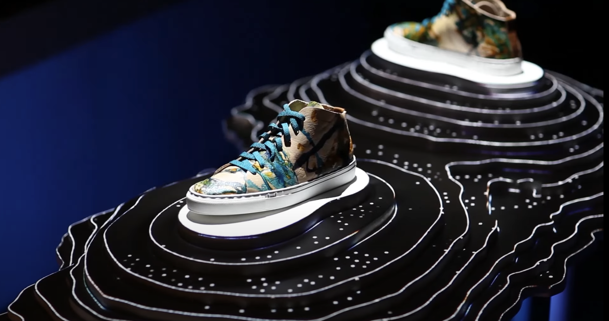
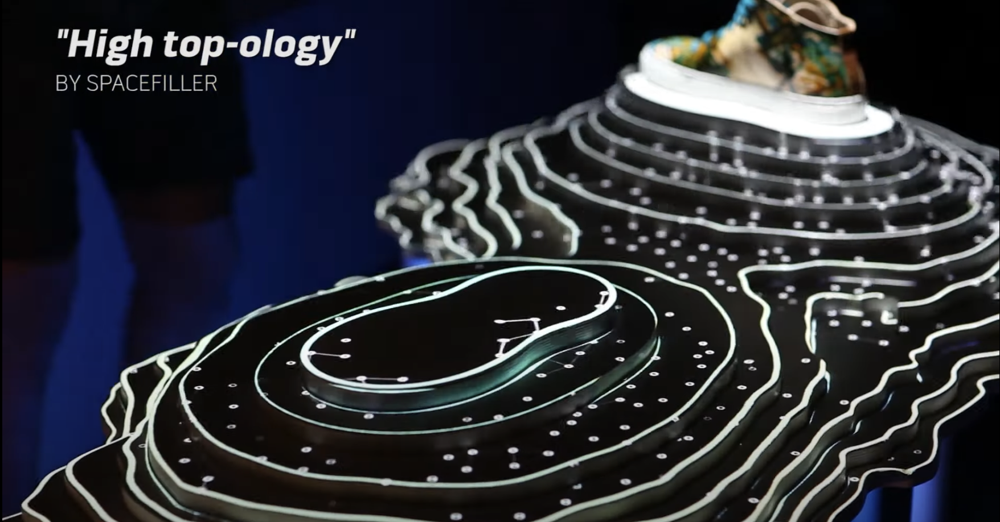
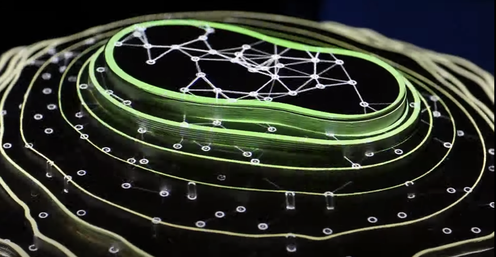
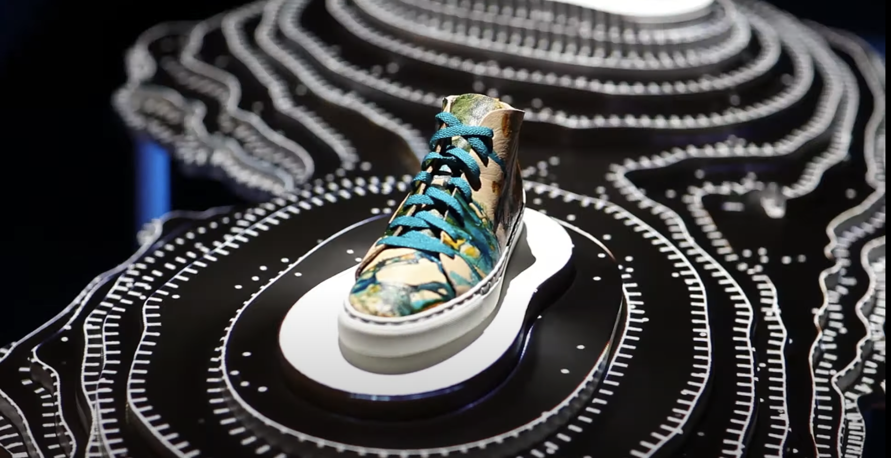
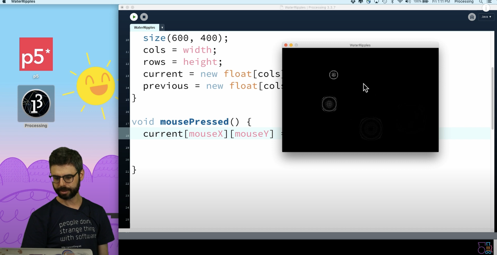

# Quiz8 by Erica Wang
## 9103 tut03

### Part 1: Imaging Technique Inspiration
**1. Descriptions**
The reference I want to use is the projection-mapped topographic installation created by Alexander's team. They utilized projectors and sensors to achieve interactive ripple effects, as well as particle combinations and movements. These effects are incredibly beautiful, and different animations are displayed when users interact with the installation.
 For my assignment, I could incorporate similar ripple and particle effects, as well as transitions between different animations. For instance, in the creative presentation of "Wheels of Fortune," similar effects could be used to display the original image, enriching the work with animations or enabling users to interact and generate unique effects.

 **2. Images showcase and link**

 -Here is the link (https://www.youtube.com/watch?v=07hiEtggHXw)

 

 

 

 

 ### Part 2: Coding Technique Exploration
**1. Descriptions**
I chose the "2D water ripple" coding technique. Although it is not entirely the same as the imaging technique in the first part, and the interaction method differs, its interactive effect is quite impressive. 
By modifying the internal particle motion paths and density in the water ripple, as well as increasing the number of ripple layers, similar effects can be created. Changing the interaction method can also generate different experiences. 
As shown in the images below, switching from click interaction to drag interaction with the mouse can present different effects. 

-Here is the link (https://thecodingtrain.com/challenges/102-2d-water-ripple)

Thanks for your watching, Have a nice day!
